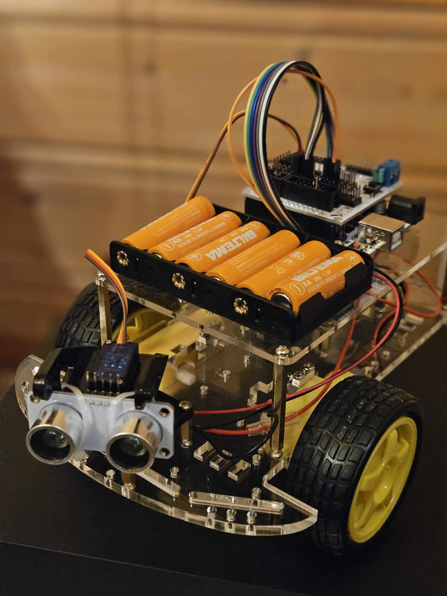

# Self-Driving Car Project


## Overview
This project is a prototype for an autonomous self-driving car that uses a combination of Arduino firmware and Python scripts. The Arduino code (in the `.ino` file) handles real-time sensor inputs and motor control, while the Python code processes higher-level data such as computer vision and decision-making through a serial connection.


## Features
- **Autonomous Navigation:** Real-time sensor fusion for obstacle detection and path planning.
- **Dual Software Architecture:** Arduino firmware for direct hardware interfacing and Python for advanced data processing.
- **Modular Design:** Easily expandable code with clear separation between hardware control and software algorithms.
- **Real-Time Feedback:** Console outputs and logging for system monitoring and debugging.

## Hardware Requirements
- **Arduino Board:** Arduino Uno (or compatible board)
- **Motor Driver:** L298N (or equivalent) for controlling DC motors
- **DC Motors & Wheels:** For propulsion and movement
- **Ultrasonic Sensors:** For distance measurement and obstacle detection
- **Camera Module:** For visual processing and road detection (optional, based on project scope)
- **Servo Motor:** For steering control (if applicable)
- **Power Supply:** Battery pack with appropriate voltage/current ratings
- **Additional Components:** Jumper wires, breadboard, resistors, and connectors

## Software Requirements
- **Arduino IDE:** To compile and upload the `.ino` file to your Arduino board.
- **Python 3.x:** For running the high-level control scripts.
- **Python Libraries:**
  - `pyserial` (for serial communication)
  - `opencv-python` (for computer vision tasks)
  - `numpy` (for numerical operations)
  - *(Additional libraries as needed)*

## Installation

### Arduino Firmware
1. **Open the Arduino Code:**
   - Open `self_driving_car.ino` in the Arduino IDE.
2. **Connect Your Arduino:**
   - Plug in your Arduino board via USB.
3. **Select Board and Port:**
   - In the Arduino IDE, choose the correct board model and port.
4. **Upload the Code:**
   - Click the upload button to flash the firmware to your Arduino.

### Python Software
1. **Clone or Download the Repository:**
   - Use `git clone` or download the ZIP file from the repository.
2. **Navigate to the Project Directory:**
   - Open a terminal in the project folder.
3. **Set Up a Virtual Environment (Optional):**
   ```bash
   python -m venv venv
   source venv/bin/activate  # On Windows use: venv\Scripts\activate
   ```
4. **Install Required Libraries:**
   ```bash
   pip install -r software/requirements.txt
   ```
5. **Run the Python Script:**
   ```bash
   python software/self_driving_car.py
   ```

## Usage
- **Start-Up:** Once the Arduino firmware is running and the Python script is executed, the car will initialize its sensors and begin processing data.
- **Operation:** The Python script reads data from the Arduino over the serial connection and processes camera input for visual cues. The system then sends commands back to the Arduino for motor control.
- **Monitoring:** Check the console output for real-time logs, error messages, and debugging information.

## Project Structure
```
self-driving-car/
├── hardware/
│   ├── circuit_diagram.pdf     # Wiring diagrams and hardware setup instructions
│   └── parts_list.md           # List of hardware components
├── firmware/
│   └── self_driving_car.ino    # Arduino firmware code
├── software/
│   ├── self_driving_car.py     # Python control and processing code
│   └── requirements.txt        # Python library dependencies
├── docs/
│   └── setup_guide.md          # Detailed project setup and installation guide
└── README.md                   # This file
```

## Circuit Diagram
For detailed wiring instructions, please refer to the `hardware/circuit_diagram.pdf` file in the repository.

## Troubleshooting
- **Serial Communication Issues:**
  - Ensure that the correct COM port is selected both in the Arduino IDE and in the Python script.
  - Verify that the baud rate in the Python script matches the one set in your Arduino code.
- **Sensor or Motor Malfunction:**
  - Check all hardware connections against the circuit diagram.
  - Confirm that sensors and motors are properly powered.
- **Camera or Vision Processing Errors:**
  - Make sure your camera drivers are correctly installed.
  - Verify the correct camera index in the Python code if using multiple cameras.

## Contributing
Contributions are welcome! Please follow these guidelines:
- Fork the repository and create a new branch for your feature or bug fix.
- Submit a pull request with a clear description of your changes.
- For major changes, open an issue first to discuss your ideas.

## License
This project is licensed under the MIT License. See the `LICENSE` file for details.

## Acknowledgments
- Special thanks to the open-source community for providing valuable resources and libraries that made this project possible.
- Acknowledge any collaborators or mentors who contributed to the development of the project.